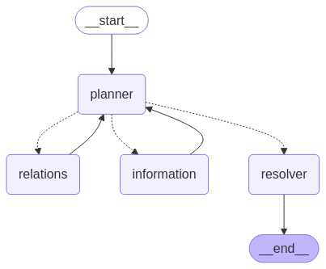
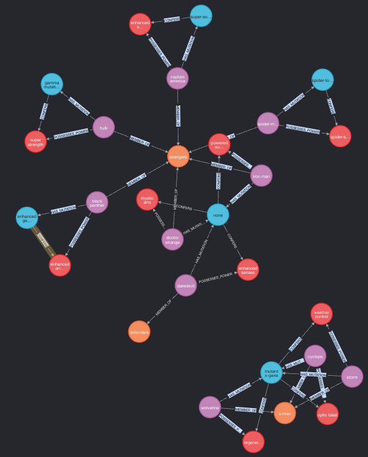

# Marvel GraphRAG

A knowledge graph-based AI system that combines structured relationship data with natural language understanding to analyze Marvel characters and their connections.

<div style="display: flex; justify-content: center;">
  
  
</div>

## Development Setup

### Building and Running with Docker Compose

1. Copy and configure environment:

```bash
cp .env.example .env
# Edit .env with your settings
```

2. Build and start all services:

```bash
docker compose up --build
```

3. Access the API:

- Swagger UI: http://localhost:8000/docs
- API endpoints: http://localhost:8000/...

4. Stop and clean up:

```bash
docker compose down -v
```

### Local Development

1. Install Python 3.11.6:

```bash
pyenv install 3.11.6
pyenv local 3.11.6
```

2. Create and activate virtual environment:

```bash
python -m venv venv
source venv/bin/activate  # or `venv\Scripts\activate` on Windows
```

3. Install dependencies:

```bash
pip install -r requirements.txt
```

4. Start Local Databases:

```bash
# Start Redis
docker run -d -p 6379:6379 --name redis-local redis/redis-stack:latest

# Start Neo4j
docker run -d \
    -p 7474:7474 -p 7687:7687 \
    -e NEO4J_AUTH=neo4j/neo4jpassforprojectgeneforge123qweasdzxc \
    --name neo4j-local \
    neo4j:5.12.0
```

5. Set up environment variables:

```bash
cp .env.example .env
```

Edit `.env` with local settings:

## Project Overview

## Core Components

1. **Knowledge Graph (Neo4j)**

   - Stores character relationships (powers, genes, teams)
   - Provides structured querying for entity connections
   - Enables graph traversal for mutual relationships

2. **Vector Store (Redis)**

   - Stores character descriptions and contextual information
   - Enables similarity search using embeddings
   - Provides relevant background information

3. **Agentic Workflow**
   - Multi-agent system with specialized roles:
     - Planner: Determines query strategy
     - Relations: Queries Neo4j for structured relationships (can be one of character, gene, power or team)
     - Information: Retrieves relevant context from Redis vector store
     - Resolver: Combines graph and vector data for comprehensive answers

## Graph-based relationship discovery

#### How the graph data is combined with the LLM?

I combined graph data with LLM capabilities by creating adapters that construct Cypher queries for different entity types (Character, Power, Gene, Team). These adapters are exposed as retrievers and connected to LangChain tools, which can be called by an agent to access both structured relationships from Neo4j and semantic context from Redis. This creates a bridge between structured graph data and natural language understanding.

### Query logic and prompt engineering

Each agent (Planner, Relations, Informationm Resolver) in the flow has its own goal abd prompt. All share a defautl root prompt.
The core intention us to have all agents collaborate on the task making sure that the query is being processed and used to retrieved both knowledge graph relations data and vector fb data.

#### Unique case handling explained:

Looking up a character with a typo -

- Planner agents detect a character name thus hanfoff to Inforamtion agent
- Information agent uses similarity search on vector db thus can handle typo and will result with information about the actual caracter
- Later Realtions agent will use the retrieved data from the Information agent thus now familiar with the actaul and correct character name
- Relations agent fetches all connections from the knowledge graph
- Resolver puts everythign together and answers

## Missing Features & Future Improvements

1. **Caching Layer Needed**

   - No caching implemented for graph/vector retrievers
   - Each query hits Neo4j/Redis directly

2. **Schema Limitations**
   - Current graph model restricts characters to single power/gene
   - Need to update schema to support:
     - Multiple powers per character
     - Multiple gene mutations

## API Examples

### Question Endpoint

```json
curl --location 'http://localhost:8000/question' --data
{
	"question": "who is part of the X-Men?",
	"response": "The X-Men team includes members such as Storm, Cyclops, and Wolverine. They possess powers like weather control, optic blast, and regeneration, respectively. The team is associated with the mutant X-gene, which grants them their unique abilities."
}
```

Special Case (typo is intentional):

```json
{
  "text": "tell me about welveri?",
  "response": "I couldn't find any information about a character named \"Welveri.\" However, I did find information about \"Wolverine,\" also known as Logan. If you meant Wolverine, here is some information:\n\n- Wolverine is one of the most complex figures in the Marvel Universe, known for his mysterious and shadowy past.\n- He has endured countless conflicts, including world wars and clandestine missions as part of covert operations like Weapon X.\n- His skeleton is famously bonded with adamantium, one of the strongest metals in existence, making him nearly indestructible.\n- Known for his gruff demeanor, fierce loyalty, and a strong sense of justice, Wolverine often struggles internally with his violent tendencies and memories of a traumatic past.\n- He has traveled globally, mastering various martial arts and combat techniques, and maintains a deep connection to Japanese culture.\n- Despite his rough exterior, Wolverine frequently displays compassion and empathy, especially toward young mutants and teammates he mentors.\n- His gritty nature and rebellious attitude often put him at odds with authority, yet those close to him know him as honorable and courageous, willing to sacrifice everything for those he cares about.\n\nIf you were referring to a different character, please provide more details or check the spelling."
}
```

```json
{
  "text": "Which gene is responsible for Spider-Man’s powers??",
  "response": "The information retrieved indicates that Spider-Man, also known as Peter Parker, has powers such as \"spider-sense and wall-crawling,\" which are related to a \"spider-toxin mutation.\" This mutation is likely responsible for his powers. Additionally, Spider-Man is associated with the Avengers team, sharing connections with characters like Doctor Strange, Black Panther, Hulk, Captain America, and Iron Man."
}
```
